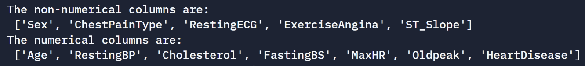
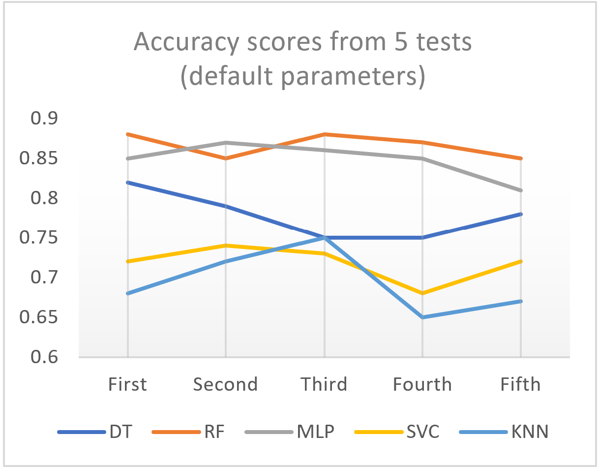
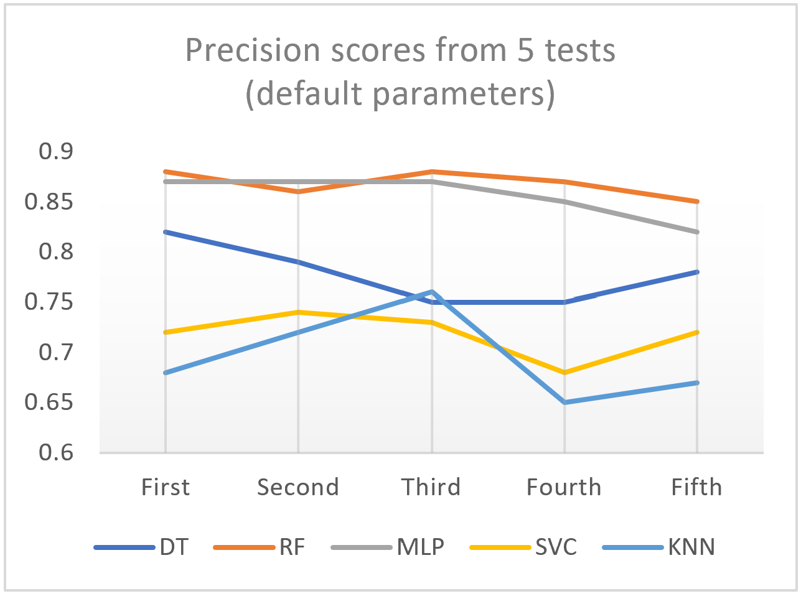
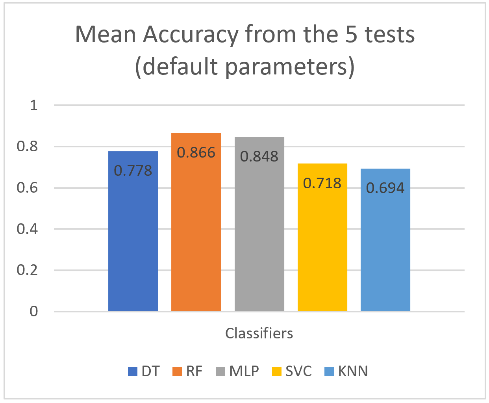
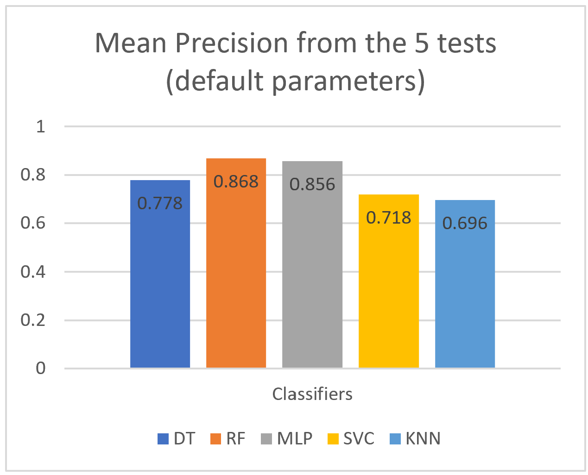
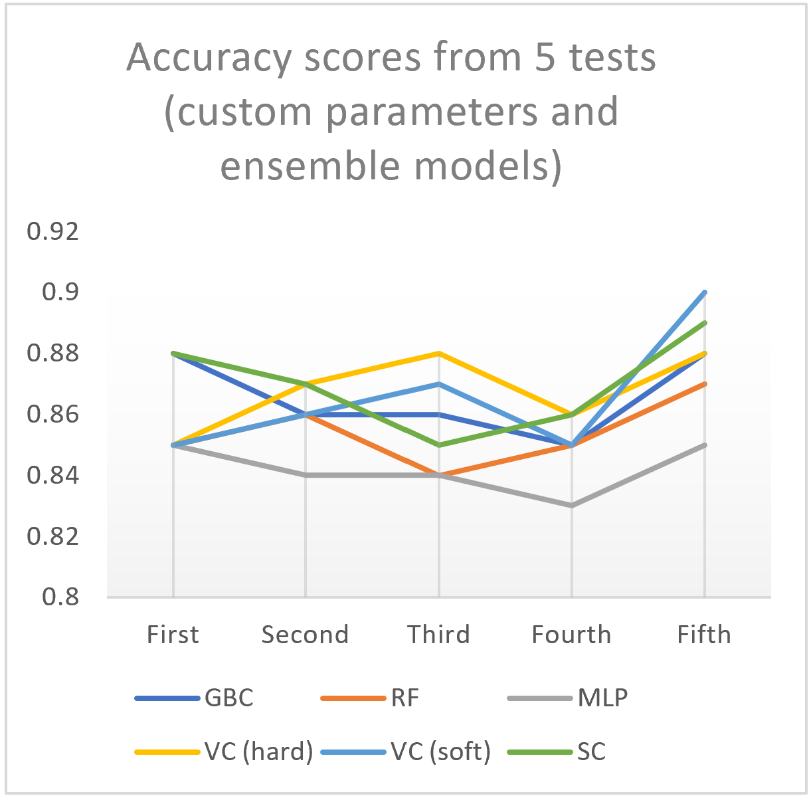
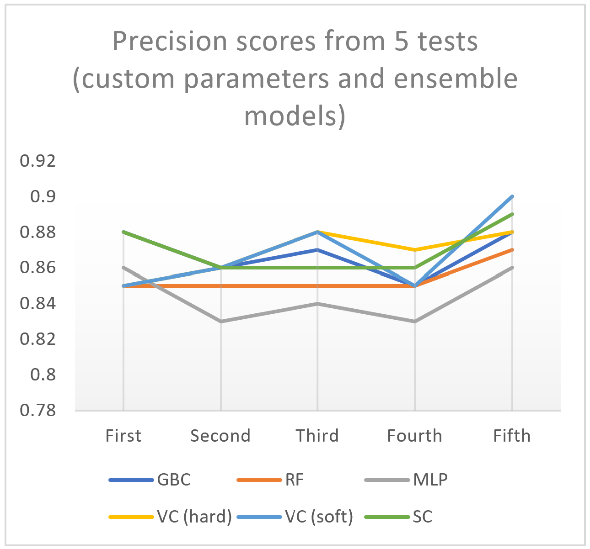
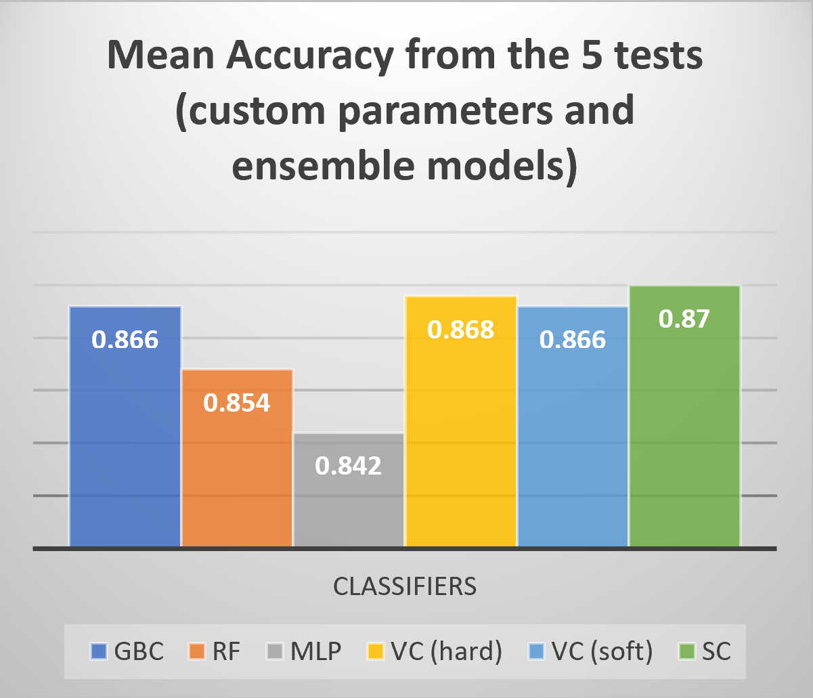
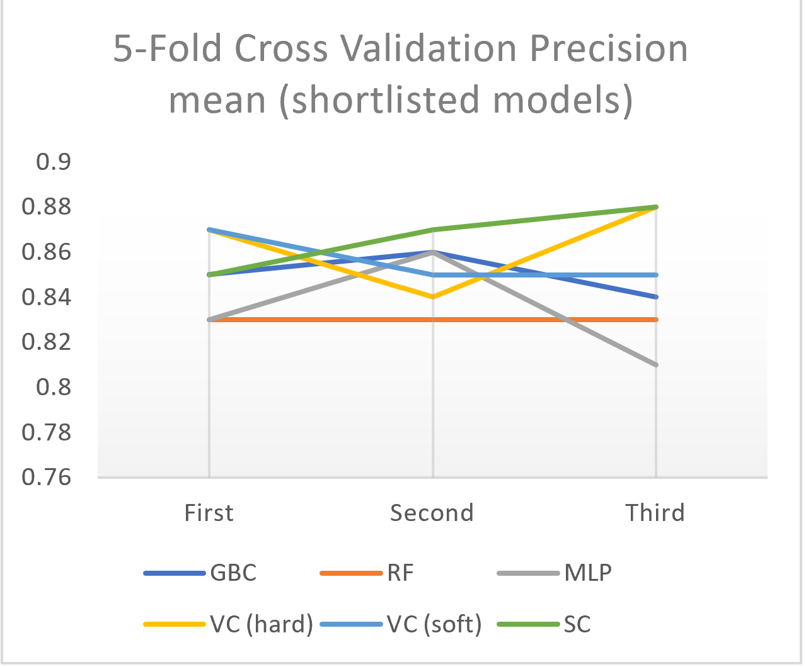

# HeartFailureClassification

In the second year of university, I had an assignment for the module 'Intelligent Systems 1' called '**Open Ended Project**'. This project involved finding a dataset for a classification/ regression problem, training & testing pre-existing models on the dataset, evaluating performance, and fine-tuning the system to (potentially) increase the models' performances. In case, I chose classification as there is a lot more to talk about. Originally, I went with a 'Mushroom classification' dataset, however this was working *too* well for this assignment, because each classifier was attaining perfect scores, meaning no comparisons or analysis could be made. Thus, after searching further for applicable datasets, I came across the 'Heart Failure' dataset. I obtained these datasets from an amazing machine-learning repository called [Kaggle](https://www.kaggle.com/), and would highly recommend visiting the site if you're interested in machine-learning. Lastly, I was required to write a report about how I went about obtaining the dataset, trained and tested the various models etc. If you wish, feel free to read-through my analysis and give feedback 😄

## Open Ended Project

### Evidence of Understanding

#### What is the functionality of your system? 
The sole functionality of my system of algorithms/models is to accurately predict whether a person has heart disease or not. This is based on various types of data collected from hospitals. 

#### What are the basic inputs and outputs?
My chosen dataset is comprised of 5 separate heart datasets from various locations across the world, making it the largest publicly-available dataset for researching heart disease. It contains 12 types/columns of clinical data from 918 different patients [2], including ‘HeartDisease’ which is this dataset’s target. I.e., the deciding factor/column of whether a patient has heart disease or not.
	
**Clinical data types**:

+ *Age*
+ *Sex* 
+ *Serum cholesterol*
+ *Chest pain type* 
+ *Maximum heartrate achieved* 
+ *Resting blood pressure*	
+ *Fasting blood sugar*
+ *Resting electrocardiogram results*
+ *Exercise-induced angina*
+ *Oldpeak (numerical ST equivalent)*
+ *Slope of the peak exercise ST segment*
+ *HeartDisease (**target**)*

These 12 columns are the basic inputs of the system, since each model utilizes them in order to form conclusions. This is done by splitting the data randomly into two separate datasets, one for training the models and the other for testing the models. This will be talked about further in the <a href="#Analysis">Analysis and preprocessing</a> section in the algorithm explanation. Once the predictions are evaluated, the result (output of the system) is a printed statement in a terminal, giving an accuracy and precision score ranging from 0 to 1 for each algorithm. 

#### What real-world problem does it solve?
Ideally, the objective is to get the percentage of correct predictions to be as high as possible, as lives could potentially be at risk from an incorrect one. This is due to the real-world usage, which (if the accuracy was almost 100%) would be to implement the system in hospitals across the globe to aid in early detections of heart disease. Implementing this would ultimately solve the problem of doctors needing to analyze extrapolated data from hundreds of tests for many hours in order to come to a conclusion. It solves this problem because the system of algorithms can analyze the data and come to conclusions of similar accuracy in a matter of seconds/minutes. In other words, machine learning techniques are useful not-only for faster detections of heart disease, but the automation of this itself removes the need for hours or even days of manual analysis from healthcare professionals.

### Algorithm Explanation
This section will cover how I obtained the heart disease dataset, prepared and cleaned it, and trained a wide variety of classification models to understand their performances on the dataset. This is so that I could shortlist the highest-performing models, and fine-tune them.

#### Obtaining the data
First, I had to get a fairly large dataset with a real-world use, that I could train various algorithms on. I was recommended a great website called ‘Kaggle’, which has a massive online community of machine-learning enthusiasts, and an enormous collection of free-to-use datasets. After a long period of searching, I stumbled upon the ‘Heart Failure Prediction Dataset’, which had over 450 code examples and a few discussions. Once I ensured that this was a viable option, I downloaded the dataset as a ‘.csv’ file, and uploaded it to my workspace on ‘Replit’. This site is a browser-based IDE that allows users to run python projects in a console or shell terminal. I also created a new python file for the project.

<p align="center">
  
</p>

#### <div id="Analysis">Analysis and pre-processing</div>
Once I imported the dataset and created the python file, I first had to read the ‘.csv’ file using ‘pandas’, which is python’s standard library for data analysis and manipulation [3]. I then had to analyze and clean/preprocess the data so that the models can interpret and use all attributes provided. In order to do this, I had to check whether the target is balanced or unbalanced. This is because algorithms that are trained on unbalanced datasets tend to have poorer accuracy when classifying unseen observations [4]. I checked this using the following code:

*Inputs:*
```python
import pandas as pd
data = pd.read_csv("heart.csv")
```
```python
# Checks whether the target label 'HeartDisease' is balanced or unbalanced
print('Amount of patients without a heart disease:', (data['HeartDisease']==0).sum())
print('Amount of patients with a heart disease:', (data['HeartDisease']==1).sum())
```
*Output:*
<p align="left">
  
</p>

The difference in observations is not significant, therefore we can assume that the target variable is balanced and will not affect algorithm performance.

Next, I had to figure out which columns/attributes were non-numerical, so that I could convert them into numerical data. This is necessary because each algorithm can only interpret numerical data. I filtered this using the following code:

*Inputs:*
```python
# Separates non-numerical and numerical columns of data in the dataset 
# and prints them in lists
non_num_columns = data.select_dtypes(include='object').columns.tolist()
num_columns = data.select_dtypes(exclude='object').columns.tolist()
print('The non-numerical columns are:\n', non_num_columns)
print('The numerical columns are:\n', num_columns)
```
*Output:*
<p align="left">
  
</p>

Once this was done, I converted the non-numerical data to numerical using the ‘.replace()’ method:
```python
# Replaces all String data with numerical data and prints it
data['Sex'] = data['Sex'].replace('F',0)# 0 is female
data['Sex'] = data['Sex'].replace('M',1)# 1 is male
data['ChestPainType'] = data['ChestPainType'].replace('ATA',1)
data['ChestPainType'] = data['ChestPainType'].replace('NAP',2)
data['ChestPainType'] = data['ChestPainType'].replace('ASY',3)
data['ChestPainType'] = data['ChestPainType'].replace('TA',4)
data['RestingECG'] = data['RestingECG'].replace('Normal',0)
data['RestingECG'] = data['RestingECG'].replace('ST',1)
data['RestingECG'] = data['RestingECG'].replace('LVH',1)
data['ExerciseAngina'] = data['ExerciseAngina'].replace('N',0)# 0 is No
data['ExerciseAngina'] = data['ExerciseAngina'].replace('Y',1)# 1 is yes
data['ST_Slope'] = data['ST_Slope'].replace('Up',1)
data['ST_Slope'] = data['ST_Slope'].replace('Flat',0)
data['ST_Slope'] = data['ST_Slope'].replace('Down',-1)
print(data)
```

After this, as stated previously, the data is divided into two subsets; one for training and the other for testing the algorithms, using the ‘train_test_split’ procedure. One of the parameters in this procedure is ’test_size’, which I specify as 0.3. This allocates 30% of the data split for testing and the other 70% for training.
```python
y = data.iloc[:, -1].values
x = data.iloc[:,0:-1].values
x_train, x_test, y_train, y_test = train_test_split(x, y, test_size = 0.3)
```

#### Using various models and measuring their performance
Once the dataset was cleaned and the train_test_split was specified, this allowed me to quickly evaluate pre-existing models that we have used in the labs. This included:

+ **KNeighborsClassifier**
+ **DecisionTreeClassifier**
+ **RandomForestClassifier**
+ **MLPClassifier**

I also independently researched a model called ‘SVC’ (Support Vector Classifier) which is based on SVM (Support Vector Machine). This is a classification algorithm that commonly performs well in datasets with relatively few samples [5]. Thus, I chose to include it in the first evaluation.
I imported each classifier from its specific library, and stored them in separate variables. I then used the ‘.fit()’ method to adjust the classifiers’ weights to best fit the training data given in each split. This then allows class predictions to be made from unseen data instances in the testing data, using the ‘.predict()’ method [6]. Finally, results are obtained using the metrics ‘accuracy_score’ and ‘precision_score’. Although these metrics are somewhat related, accuracy refers to the ratio of correctly predicted classes relative to all classes, whereas precision refers to the ratio of correctly predicted positive classes to the total predicted positive classes [7]. These metrics give a decimal score representing the percentage of correctly predicted classes. Below is an example of this, using DecisionTreeClassifier.

*Inputs:*
```python
dt = DecisionTreeClassifier()
dt = dt.fit(x_train,y_train)
y_pred = dt.predict(x_test) 
print("\nDecision tree accuracy and precision:",metrics.accuracy_score(y_test, y_pred), metrics.precision_score(y_test,y_pred, average = 'macro'))
```
*Output:*
<p align="left">
  
</p>

Since I had no clue as to how these models would perform on the heart dataset, I decided to first test them all using their default hyperparameters. This is done by simply leaving the models parentheses blank before the learning process commences, as seen in the first image in Figure 8. In order to get a more accurate depiction of each model’s accuracy and precision, I ran them 5 times each, recorded the results, and calculated the mean accuracy and precision.

  |  
:-------------------------:|:-------------------------:
  |  

From these results, it is obvious that MLP and RandomForest are the best-performing models, with a mean accuracy and precision of over 84%. It is also worth noting that in this dataset, the differentiation between these scores is negligible, as DecisionTree and SVC’s mean scores were equal, and the other classifiers’ mean precision scores were only slightly higher than their mean accuracies. Since all models achieved a relatively high score with default parameters, we can assume that the dataset was thoroughly processed and sorted before it was published.

#### Short-listing promising models and fine-tuning the system
Based on the results from the first set of tests, I made the decision to shortlist the RandomForest and MLP classifiers due to their astounding performance. One technique for boosting performance is the usage of ensemble models. These combine separate models and account for each of their predictions, often resulting in higher overall performance, once combined. Common examples of ensemble models that apply this technique include ‘VotingClassifier’ and ‘StackingClassifier’, as they require ‘estimators’ i.e., models to use as predictors. After further research, I decided that ‘GradientBoostingClassifier’ would also be a good advocate, as this model applies a similar strategy to RandomForest by combining multiple weaker prediction-models, typically decision trees. However, it does this in a forward stage-wise fashion, allowing the arbitrary differentiable loss functions of the weaker models to be optimized [8]. This often leads to it performing better than RandomForest, so I used it along with the other ensemble models.

Furthermore, in an attempt to further boost performance, I tweaked the hyperparameters of a few of the models. For example, GradientBoostingClassifier contains one called ‘n_estimators’, which represents the number of boosting stages to perform [9]. According to the scikit-learn page, the default value of this parameter is 100, and increasing it usually results in better performance. Thus, I changed this by adding ‘n_estimators=200’ inside the parentheses of the classifier. The changes made to each model’s hyperparameters can be seen in Figure 10.

```python
gbc = GradientBoostingClassifier(n_estimators=200)
rf = RandomForestClassifier(n_estimators=12, criterion='entropy')
mlp = MLPClassifier(hidden_layer_sizes=250, max_iter=500)
eclf1 = VotingClassifier(estimators=[('gbc', gbc), ('rf', rf), ('mlp', mlp)], voting='hard')
eclf2 = VotingClassifier(estimators=[('gbc', gbc), ('rf', rf), ('mlp', mlp)], voting='soft')
eclf3 = StackingClassifier(estimators=[('gbc', gbc), ('rf', rf), ('mlp', mlp)])
```

Just Like the first set of tests, I ran each classifier 5 times and recorded the results in a graph, then calculated their mean accuracy and precision score.

  |  
:-------------------------:|:-------------------------:
  |  

***Note:*** *There are 2 voting classifiers, (one being hard voting, the other being soft). This is because hard voting ensemble models classify data instances based on the majority vote of all models involved, i.e., the mode prediction. On the other hand, soft voting models classify data based on the weights (importance) of each model involved. These weights are assigned according to the probability of all predictions made [10].*

Based on this set of results, StackingClassifier is the best-performing ensemble model, with a mean accuracy and precision score of 87%. The hard and soft VotingClassifiers had very similar performance, only differentiating slightly in accuracy. GradientBoostingClassifier also performed well, attaining the same accuracy as the soft VotingClassifier. However, it turned out that the way that I changed the hyperparameters of the individual models noticeably worsened their performances. Therefore, I removed the changes from the parentheses for the third and final test of performance. The last thing to note from these results at face-value is that the movement of each model’s performance is somewhat related. This will be explained further in the next section.

The last set of tests that I performed on each model had the sole purpose of gauging their accuracy and precision even better. I did this using k-fold cross validation, where k is the number of folds/sections that the input data is split into. Each section is used as a testing set at a certain stage, and each time, the other sections serve as training sets. In my case, I decided to use 5-fold cross validation. The difference in this sets of tests is that I only ran the models 3 times. This is because 5-fold cross validation returns 5 different accuracy and precision scores for each classifier, and the mean of these scores can be printed below using the ‘.mean()’ method. The following graphs show the recorded mean of each models performance across the three instances.

  |  
:-------------------------:|:-------------------------:

These final results were quite surprising, due to the fact that 4 of the 6 models had a mean accuracy score of 0.86 in the first test, and the StackingClassifier and MLPClassifier’s accuracy scores did not change at all. Moreover, the hard and soft VotingClassifiers behaved very differently to before. This is because the soft voting model’s mean accuracies were consistently higher than the hard voting model’s, despite following the same trend. Also, the hard voting’s mean accuracy and precision scores move in opposite directions, however this could be a coincidence/anomaly.


